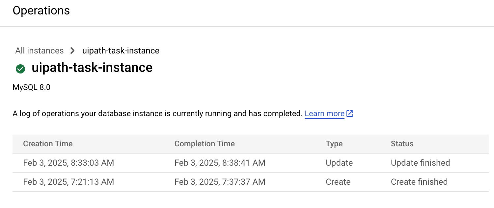
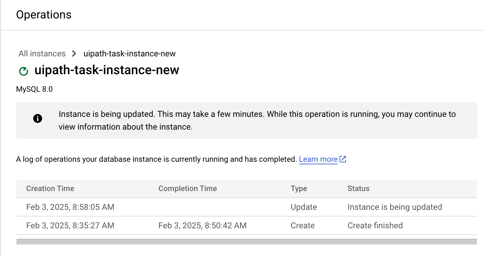
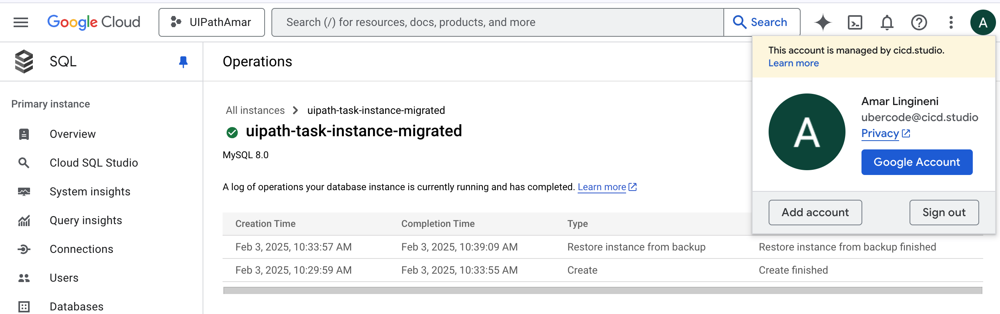

# Sledge

Sledge is a CLI tool to manage GCP Cloud SQL operations. It is built with Cobra, Viper, and GCP's Cloud SQL Admin API.

## Features

- Create a new Cloud SQL instance
- Delete an existing Cloud SQL instance
- Upgrade a Cloud SQL instance version or tier
- Backup a Cloud SQL instance
- Restore a Cloud SQL instance from a backup
- Migrate a Cloud SQL instance from one region to another via backup & restore

## Installation

1. Clone the repository:
   
    git clone https://github.com/code4bread/sledge.git
    cd sledge
   

2.  Install dependencies:
  
    ./starter.sh
    

3. Set up your Google Cloud credentials:
  
    echo "export GOOGLE_APPLICATION_CREDENTIALS=\"/Users/next/sledge/uipath-amar-ed501cd5a389.json\"" >> ~/.bash_profile
    
### Build the Project into a binary called sledge

 go build -o sledge  

## Usage

### Create a new Cloud SQL instance

```sh
sledge create --project <project-id> --instance <instance-name> --tier <tier> --region <region> --dbVersion <db-version>
```

### Delete an existing Cloud SQL instance

```sh
sledge delete --project <project-id> --instance <instance-name>
```

### Upgrade a Cloud SQL instance version or tier

```sh
sledge upgrade --project <project-id> --instance <instance-name> --dbVersion <db-version> --tier <tier>
```

### Backup a Cloud SQL instance

```sh
sledge backup --project <project-id> --instance <instance-name> --description <description>
```

### Restore a Cloud SQL instance from a backup

```sh
sledge restore --project <project-id> --sourceInstance <source-instance> --targetInstance <target-instance> --backupRunId <backup-run-id>
```

### Migrate a Cloud SQL instance from one region to another

```sh
sledge migrate --sourceProject <source-project> --sourceInstance <source-instance> --targetProject <target-project> --targetInstance <target-instance> --targetRegion <target-region> --backupDesc <backup-description> --pollInterval <poll-interval> --pollTimeout <poll-timeout>
```

## Configuration

Setup the configuration for each of the cloudsql you wish to operate using 

use the .sledge.yaml file in the home directory or by specifying a config file with the `--config` flag.

Below is the file used for this demo ./.sledge.yaml

```yaml
create:
  project: "uipath-amar"
  instance: "uipath-task-instance"
  region: "us-central1"
  dbVersion: "MYSQL_8_0"
  tier: "db-f1-micro"

upgrade:
  project: "uipath-amar"
  instance: "uipath-task-instance"
  dbVersion: "MYSQL_8_0"
  tier: "db-g1-small"

migrate:
  sourceProject: "uipath-amar"
  sourceInstance: "uipath-task-instance"
  targetProject: "uipath-amar"
  targetInstance: "uipath-task-instance-new"
  targetRegion: "us-east1"
  backupDesc: "migrate-backup-run"
  pollInterval: "5s"
  pollTimeout: "10m"

delete:
  project: "uipath-amar"
  instance: "uipath-task-instance"

backup:
  project: "uipath-amar"
  instance: "uipath-task-instance"
  description: "on-demand-backup"

restore:
  project: "uipath-amar"
  sourceInstance: "uipath-task-instance"
  targetInstance: "uipath-task-instance-restored"
```

## Testing

To run the tests, use the following command:

```sh
go test ./tests/unit/...
```

# End To End Provisioning  Demo 
## Creation of cloudsql instance 
<pre>
next@Amars-MacBook-Pro sledge % ./sledge create --config ./.sledge.yaml
    INFO[2025-02-03T07:21:11-08:00] Using config file:./.sledge.yaml             
    INFO[2025-02-03T07:21:13-08:00] Creation initiated for instance uipath-task-instance. Operation: 06990821-1536-4ca8-9a64-dda400000032
</pre>


## Delete of cloudsql instance
<pre>
next@Amars-MacBook-Pro sledge % ./sledge delete   --config ./.sledge.yaml  --instance uipath-task-instance-new
    INFO[2025-02-03T08:00:13-08:00] Using config file:./.sledge.yaml             
    INFO[2025-02-03T08:00:14-08:00] Deletion initiated for instance uipath-task-instance-new. Operation: 4bb43527-6db2-4d7b-988c-216e00000032 
</pre>

## upgrade of cloudsql instance
<pre>
next@Amars-MacBook-Pro sledge % ./sledge upgrade   --config ./.sledge.yaml                              
    INFO[2025-02-03T08:33:02-08:00] Using config file:./.sledge.yaml             
    INFO[2025-02-03T08:33:03-08:00] Upgrade initiated for instance uipath-task-instance. Operation: 8e48bcfe-a962-444d-b29e-a6cd00000032 
</pre>
## create a new cloudsql instance 
<pre>
next@Amars-MacBook-Pro sledge % ./sledge create  --config ./.sledge.yaml  --instance uipath-task-instance-new --region us-east1   
    INFO[2025-02-03T08:35:25-08:00] Using config file:./.sledge.yaml             
    INFO[2025-02-03T08:35:27-08:00] Creation initiated for instance uipath-task-instance-new. Operation: e0db21b2-bf93-43d9-80bc-661d00000026 
</pre>
## upgrade the new cloudsql instance 
<pre>
next@Amars-MacBook-Pro sledge % ./sledge upgrade   --config ./.sledge.yaml  --instance uipath-task-instance-new                
    INFO[2025-02-03T08:58:04-08:00] Using config file:./.sledge.yaml             
    INFO[2025-02-03T08:58:05-08:00] Upgrade initiated for instance uipath-task-instance-new. Operation: 6453c2a6-6aa7-457e-bce3-b4c500000026 
</pre>




# migration of uipath-task-instance to uipath-task-instance-migrated
<pre>
next@Amars-MacBook-Pro sledge % ./sledge migrate --config ./.sledge.yaml
INFO[2025-02-03T10:28:35-08:00] Using config file:./.sledge.yaml             
INFO[2025-02-03T10:28:35-08:00] [1/4] Creating on-demand backup for source instance uipath-task-instance... 
INFO[2025-02-03T10:28:35-08:00] Backup operation started: a00e63c0-7494-4814-9584-767c00000032 
INFO[2025-02-03T10:29:58-08:00] [1/4] Backup complete.
                      
INFO[2025-02-03T10:29:59-08:00] Using BackupRunId: 1738607315889
            
INFO[2025-02-03T10:29:59-08:00] [2/4] Getting source instance info...        
INFO[2025-02-03T10:29:59-08:00] [2/4] Source instance retrieved. DB Version: MYSQL_8_0
 
INFO[2025-02-03T10:29:59-08:00] [3/4] Creating new instance uipath-task-instance-migrated in region us-central1... 
INFO[2025-02-03T10:29:59-08:00] Creation operation started: 08ade031-d891-4d6e-b0f5-c68100000032 
INFO[2025-02-03T10:33:57-08:00] [3/4] Target instance created successfully.
 
INFO[2025-02-03T10:33:57-08:00] [4/4] Restoring backup ID 1738607315889 from uipath-task-instance into uipath-task-instance-migrated... 
INFO[2025-02-03T10:33:57-08:00] Restore operation started: 3381633a-3a8e-47db-9c21-5c0d00000032 
INFO[2025-02-03T10:39:13-08:00] [4/4] Migration complete. New instance: uipath-task-instance-migrated in region: us-central1 
</pre>




## License

This project is licensed under the MIT License.
